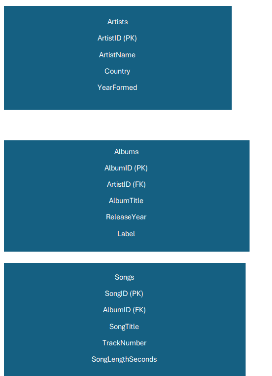
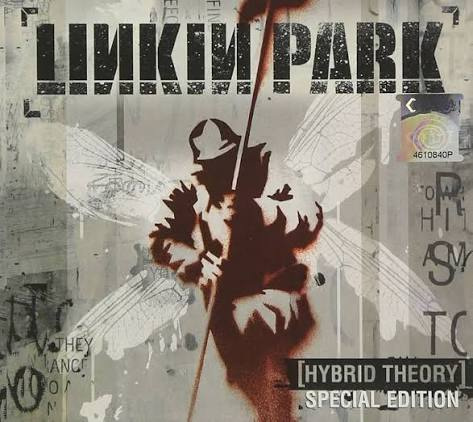
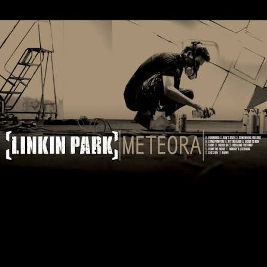

# Nu Metal Music Library Database

## Overview

This project is a relational music library database focused on nu metal artists, albums, and songs. I chose this topic because I enjoy listening to bands such as Linkin Park, Korn, Slipknot, Limp Bizkit, and System of a Down.

The database was created using SQLite and contains three connected tables: Artists, Albums, and Songs.

## Database Structure

### Artists

- ArtistID (Primary Key)
- ArtistName
- Country
- YearFormed

### Albums

- AlbumID (Primary Key)
- ArtistID (Foreign Key)
- AlbumTitle
- ReleaseYear
- Label

### Songs

- SongID (Primary Key)
- AlbumID (Foreign Key)
- SongTitle
- TrackNumber
- SongLengthSeconds

## Relationships

- One artist can have multiple albums.
- One album can have multiple songs.
- `Albums.ArtistID` connects albums to artists.
- `Songs.AlbumID` connects songs to albums.
## Database Diagram

## SQL Skills Demonstrated

The project includes examples of:

- SELECT
- COUNT
- GROUP BY
- HAVING
- ORDER BY
- AND conditions
- IN
- BETWEEN
- Mathematical calculations
- JOIN

## Technologies

- SQLite
- DB Browser for SQLite
- SQL

## Files

- `TristanBoodhoo_MusicLibrary.db` — SQLite database
- `create_tables.sql` — database table definitions
- `insert_data.sql` — database records
- `queries.sql` — SQL query examples

## Project Purpose

This project helped me practice relational database design, primary and foreign keys, normalization, and SQL queries. It also gave me experience organizing related information into multiple tables instead of storing everything in one large table.
## Some of My Favorite Albums

### Linkin Park — Hybrid Theory

### Linkin Park — Meteora

### System of a Down — Toxicity

